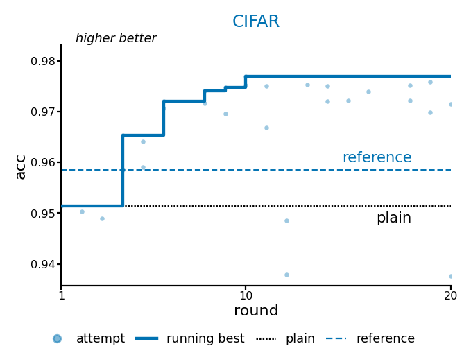

# steer-cifar

CIFAR-10 steered auto-nn example: experiment ledger, round configs, experience notes, and a Fig.3-style trajectory plot.

## Contents

| Path | Role |
|------|------|
| `_runs/results.tsv` | Experiment ledger (scores / tags) |
| `_runs/configs/` | Per-round train configs |
| `saved/keepers.json` | Current best pointer |
| `saved/experiment_journal.json` | Round journal facts |
| `EXPERIENCE.md` | Run narrative |
| `docs/figures/fig3_style_trajectory.png` | Trajectory: attempts / running best / plain / reference |
| `train.py`, `workspace/`, `contract/` | Train code and contract surface |
| `PROTOCOL.md`, `CLAUDE.md` | Protocol entrypoints |

## Snapshot

- **Goal:** validation accuracy 0.99
- **Best (keeper):** 0.977 (WideResNet-28-10, cutmix+mixup, label smoothing 0.1)
- **Baselines:** plain ≈ 0.9514 (SimpleDLA); reference ≈ 0.9585 (DLA)



## Quick look

```bash
head -5 _runs/results.tsv
cat saved/keepers.json
```

CIFAR-10 data: see `data/README.md`. Training depends on the auto-nn tooling/skills stack; this repository is the case artifact.

## License

[MIT](LICENSE) © 2026 xieyulai
